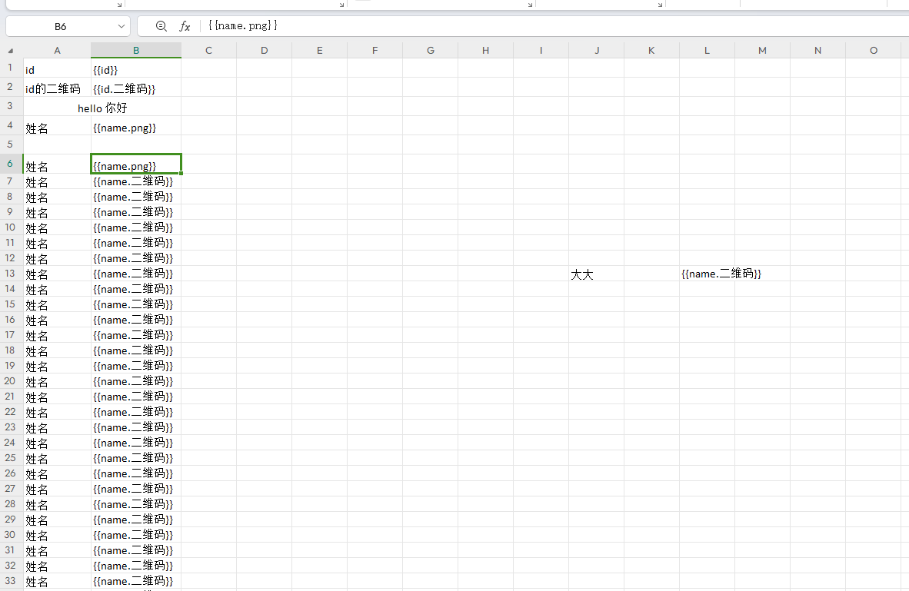
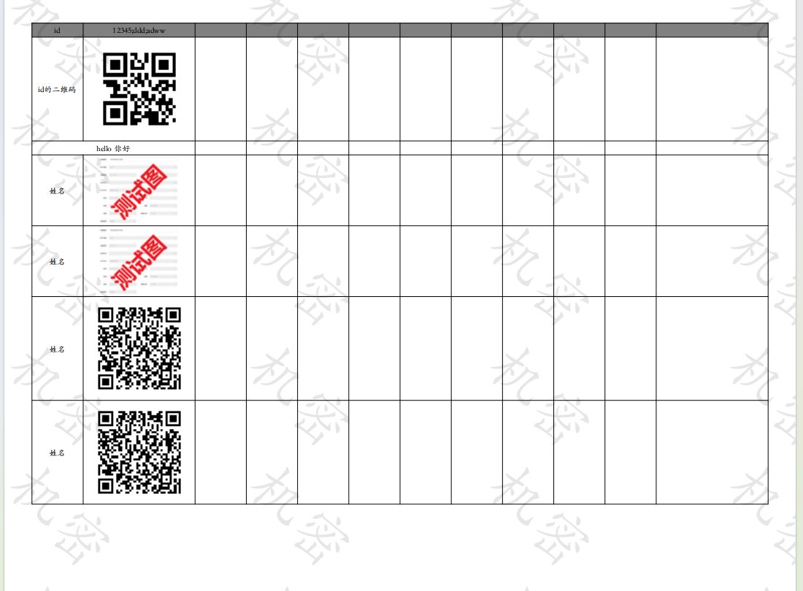

# xlfill2pdf

> 🚧 警告：这是一个"能用就行"的项目！
> 
> 💡 如果发现 bug，那一定是特性！
> 
> 🔧 代码写得不够优雅？随时欢迎 PR！
> 
> 🎯 目标是：能用 > 好用 > 很好用

一个用于将 Excel 文件转换为 PDF 的工具，支持占位符替换、二维码生成、水印添加等功能。
本项目是自用代码整理后的开源版本，功能可能不够完善，但核心功能已经可以正常使用。
欢迎根据实际需求修改代码，如果对你有帮助，请点个星！

## 特性

- 支持变量替换
- 支持多图片自动布局
- 支持二维码生成（普通二维码和带信息二维码）
- 支持水印添加
- 支持自定义字体
- 支持网络图片和本地图片
- 支持网络 Excel 文件

## 安装

```bash
pip install xlfill2pdf
```

## 基础使用

```python
from xlfill2pdf import FontManager, ExcelProcessor

# 创建字体管理器
font_manager = FontManager()
font_manager.set_font("/path/to/your/font.ttf")  # 可选：设置自定义字体

# 创建处理器
processor = ExcelProcessor(
    font_manager=font_manager,
    watermark_text="机密",  # 可选：添加水印
    watermark_alpha=0.1,    # 水印透明度
    watermark_angle=-45,    # 水印角度
    watermark_color=(0, 0, 0)  # 水印颜色 (R,G,B)
)

# 处理数据
data = {
    "name": "张三",
    "id": "12345"
}

# 转换为 PDF
pdf_data = processor.process_excel_to_pdf("template.xlsx", data)

# 保存 PDF
with open("output.pdf", "wb") as f:
    f.write(pdf_data)
```

## Excel 模板格式

在 Excel 模板中使用以下格式的占位符：

- 文本占位符：`{{name}}`
- 二维码占位符：`{{id.二维码}}`

## 自定义处理器

可以注册自定义处理器来处理特殊的占位符：

```python
def handle_image(cell, field_name, data_dict):
    img = openpyxl.drawing.image.Image("image.png")
    img.width = 100
    img.height = 100
    cell.value = None
    column_letter = openpyxl.utils.get_column_letter(cell.column)
    anchor = f"{column_letter}{cell.row}"
    img.anchor = anchor
    return img, column_letter, cell.row # 返回图片对象、锚点、行号
    # return 'xxxx' 则替换为 'xxxx'

# 注册处理器
processor.register_handler(".图片", handle_image)
```

## 水印设置

```python
processor = ExcelProcessor(
    font_manager=font_manager,
    watermark_text="机密文件",      # 水印文字
    watermark_alpha=0.1,           # 透明度 (0-1)
    watermark_angle=-45,           # 角度
    watermark_color=(216, 0, 54)   # RGB颜色
)
```

## 生成增加自定义信息的二维码
QRCodeGenerator 是一个功能强大的二维码生成器类，支持在二维码周围添加自定义文字信息。它提供了灵活的配置选项和多种输出格式。

## 主要功能

- 生成标准二维码
- 支持自定义背景尺寸和颜色
- 支持在二维码周围添加文字说明
- 支持自定义字体和字体样式
- 提供多种输出格式（bytes、文件路径、临时文件）
- 支持上下文管理器（Context Manager）
- 支持列表布局和自动边框绘制

## 初始化参数

- `font_manager`: FontManager 实例，用于管理字体
- `background_size`: 背景图尺寸，默认 (350, 180)
- `background_color`: 背景颜色，默认白色
- `qr_size`: 二维码尺寸，默认 (100, 100)
- `qr_position`: 二维码在背景中的位置，默认 (20, 40)
- `default_font_size`: 默认字体大小，默认 12
- `default_font_color`: 默认字体颜色，默认黑色
- `output_type`: 输出类型，可选 "path"、"temp"、"bytes"、"base64"
- `output_path`: 输出文件路径（当 output_type 为 "path" 时必需）
- `border`: 边框设置，可选，支持自定义边框颜色和宽度

## 核心方法

### create_info_qrcode

创建带有文字信息的二维码。

参数：
- `qr_data`: 二维码数据内容
- `text_info`: 文字信息配置字典

## 列表布局功能

QRCodeGenerator 支持创建表格式的列表布局，可以自动处理文本换行、边框绘制和垂直居中等功能。

### 列表配置示例

```python
from xlfill2pdf import QRCodeGenerator, FontManager

# 初始化
font_manager = FontManager()
generator = QRCodeGenerator(
    font_manager=font_manager,
    background_size=(600, 400),
    qr_size=(150, 150),
    qr_position=(20, 40)
)

# 创建带表格布局的二维码
text_info = [
    {
        "list": [
            {"text": "设备名称：测试设备", "font_size": 16, "text_wrap": True},
            {"text": "设备型号：XYZ-100", "font_size": 16},
            {"text": "安装时间：2023-05-15", "font_size": 16},
        ],
        "start_position": ("30vw", "30vh"),  # 表格起始位置
        "column": 1,                         # 列数
        "out_border": True,                  # 显示外边框
        "inner_border": True,                # 显示内边框
        "width": "50vw",                     # 表格宽度
        # "height": "50vh",                  # 可选：表格高度，默认为100vh
    }
]

result = generator.create_info_qrcode(
    qr_data="https://example.com",
    text_info=text_info
)
```

### 列表配置参数

- `list`: 列表项数组，每个项目包含文本内容和样式
- `start_position`: 列表起始位置，支持 vw/vh 单位
- `column`: 列数，默认为 1
- `out_border`: 是否显示外边框，可以是布尔值或 (颜色, 宽度) 元组
- `inner_border`: 是否显示内边框，可以是布尔值或 (颜色, 宽度) 元组
- `width`: 列表宽度，支持 vw/vh/rem 单位
- `height`: 列表高度，支持 vw/vh/rem 单位，默认为 100vh
- `margin`: 列表外边距，默认为 0.5rem

### 列表项配置参数

- `text`: 文本内容
- `font_size`: 字体大小，支持 rem/vw/vh 单位
- `color`: 字体颜色，可以是颜色名称或 RGB 元组
- `text_wrap`: 是否自动换行，默认为 False
- `margin`: 项目内边距，默认继承列表的 margin 设置

## example




## API 参考

### FontManager

字体管理器，用于管理 PDF 生成时使用的字体。

```python
font_manager = FontManager()
font_manager.set_font("/path/to/font.ttf", "FontName")
```

### ExcelProcessor

Excel 处理器，负责转换和生成 PDF。


### ExcelProcessor 参数说明

- `font_manager`: FontManager 实例，用于管理字体
- `prefix`: 变量前缀，默认 "{{"
- `suffix`: 变量后缀，默认 "}}"
- `qrcode_suffix`: 二维码后缀，默认 ".qrcode"
- `image_suffix`: 图片后缀，默认 ".png"
- `info_qrcode_suffix`: 带信息二维码后缀，默认 ".info_qrcode" (新增)
- `use_default_image_handlers`: 是否使用默认图片处理器，默认 True
- `use_default_qrcode_handlers`: 是否使用默认二维码处理器，默认 True
- `use_default_info_qrcode_handlers`: 是否使用默认带信息二维码处理器，默认 True (新增)
- `watermark_text`: 水印文字，默认 None
- `watermark_alpha`: 水印透明度，默认 0.1
- `watermark_angle`: 水印角度，默认 -45
- `watermark_color`: 水印颜色，默认 (0, 0, 0)
- `qrcode_template`: 二维码信息模板，默认 None (新增)
```python
qrcode_template = {
    "title": {
        "text": "设备标识牌",
        "position": (150, 40),
        "font_size": 32, # 字体大小 选填
        "color": "black", # 字体颜色 选填
    }
}
```

## 注意事项

1. 确保系统中安装了所需的字体, 使用默认的字体可能显示错误（如：你显示为尼等）
2. Excel 模板中的占位符格式必须严格匹配
3. 图片处理需要足够的系统内存
4. 临时文件会自动清理

## License

MIT
```
## 致谢
qrcode
reportlab
openpyxl
requests
