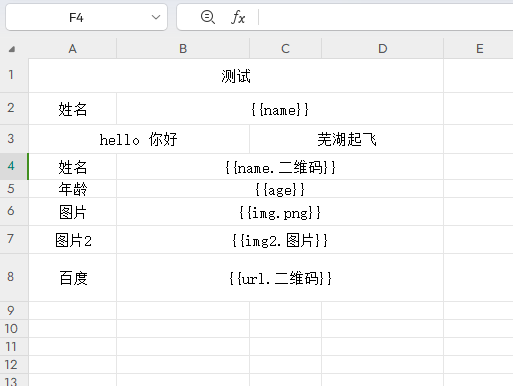

# xlfill2pdf

> 🚧 警告：这是一个"能用就行"的项目！
> 
> 💡 如果发现 bug，那一定是特性！
> 
> 🔧 代码写得不够优雅？随时欢迎 PR！
> 
> 🎯 目标是：能用 > 好用 > 很好用

一个用于将 Excel 文件转换为 PDF 的工具，支持占位符替换、二维码生成、水印添加等功能。
本项目是自用代码整理后的开源版本，功能可能不够完善，但核心功能已经可以正常使用。
欢迎根据实际需求修改代码，如果对你有帮助，请点个星！

## 特性

- 支持变量替换
- 支持多图片自动布局
- 支持二维码生成（普通二维码和带信息二维码）
- 支持水印添加
- 支持自定义字体
- 支持网络图片和本地图片
- 支持网络 Excel 文件

## 安装

```bash
pip install xlfill2pdf
```

## 基础使用

```python
from xlfill2pdf import FontManager, ExcelProcessor

# 创建字体管理器
font_manager = FontManager()
font_manager.set_font("/path/to/your/font.ttf")  # 可选：设置自定义字体

# 创建处理器
processor = ExcelProcessor(
    font_manager=font_manager,
    watermark_text="机密",  # 可选：添加水印
    watermark_alpha=0.1,    # 水印透明度
    watermark_angle=-45,    # 水印角度
    watermark_color=(0, 0, 0)  # 水印颜色 (R,G,B)
)

# 处理数据
data = {
    "name": "张三",
    "id": "12345"
}

# 转换为 PDF
pdf_data = processor.process_excel_to_pdf("template.xlsx", data)

# 保存 PDF
with open("output.pdf", "wb") as f:
    f.write(pdf_data)
```

## Excel 模板格式

在 Excel 模板中使用以下格式的占位符：

- 文本占位符：`{{name}}`
- 二维码占位符：`{{id.二维码}}`

## 自定义处理器

可以注册自定义处理器来处理特殊的占位符：

```python
def handle_image(cell, field_name, data_dict):
    img = openpyxl.drawing.image.Image("image.png")
    img.width = 100
    img.height = 100
    cell.value = None
    column_letter = openpyxl.utils.get_column_letter(cell.column)
    anchor = f"{column_letter}{cell.row}"
    img.anchor = anchor
    return img, column_letter, cell.row # 返回图片对象、锚点、行号
    # return 'xxxx' 则替换为 'xxxx'

# 注册处理器
processor.register_handler(".图片", handle_image)
```

## 水印设置

```python
processor = ExcelProcessor(
    font_manager=font_manager,
    watermark_text="机密文件",      # 水印文字
    watermark_alpha=0.1,           # 透明度 (0-1)
    watermark_angle=-45,           # 角度
    watermark_color=(216, 0, 54)   # RGB颜色
)
```

## example



## API 参考

### FontManager

字体管理器，用于管理 PDF 生成时使用的字体。

```python
font_manager = FontManager()
font_manager.set_font("/path/to/font.ttf", "FontName")
```

### ExcelProcessor

Excel 处理器，负责转换和生成 PDF。


### ExcelProcessor 参数说明

- `font_manager`: FontManager 实例，用于管理字体
- `prefix`: 变量前缀，默认 "{{"
- `suffix`: 变量后缀，默认 "}}"
- `qrcode_suffix`: 二维码后缀，默认 ".qrcode"
- `image_suffix`: 图片后缀，默认 ".png"
- `info_qrcode_suffix`: 带信息二维码后缀，默认 ".info_qrcode" (新增)
- `use_default_image_handlers`: 是否使用默认图片处理器，默认 True
- `use_default_qrcode_handlers`: 是否使用默认二维码处理器，默认 True
- `use_default_info_qrcode_handlers`: 是否使用默认带信息二维码处理器，默认 True (新增)
- `watermark_text`: 水印文字，默认 None
- `watermark_alpha`: 水印透明度，默认 0.1
- `watermark_angle`: 水印角度，默认 -45
- `watermark_color`: 水印颜色，默认 (0, 0, 0)
- `qrcode_template`: 二维码信息模板，默认 None (新增)
```python
qrcode_template = {
    "title": {
        "text": "设备标识牌",
        "position": (150, 40),
        "font_size": 32, # 字体大小 选填
        "color": "black", # 字体颜色 选填
    }
}
```

## 注意事项

1. 确保系统中安装了所需的字体, 使用默认的字体可能显示错误（如：你显示为尼等）
2. Excel 模板中的占位符格式必须严格匹配
3. 图片处理需要足够的系统内存
4. 临时文件会自动清理

## License

MIT
```

